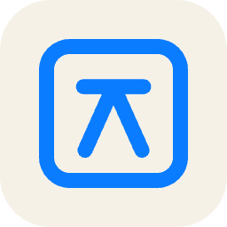

<p align="center">
  
</p>

# Jamoa (자모아)

> 자모(Jamo)를 모아(Moa) — 풀어쓰기(NFD)된 한글 파일명을 모아쓰기(NFC)로.

Windows ↔ macOS 파일 교환 시 발생하는 **한글 자모분리(NFD) 파일명**을 자동으로 정규화(NFC)해주는 프로그램입니다.

맥에서 만든 파일을 윈도우로 옮기면 `ㅂㅗㄱㅗㅅㅓ.hwp`처럼 보이는데, 지정한 폴더를 실시간 감시해 자모가 분리된 파일명을 자동으로 변경합니다.

## 설치

[Releases](https://github.com/iskim1018/jamoa/releases)에서 최신 설치본을 내려받으세요.

- **macOS**: `Jamoa_x.y.z_universal.dmg` — Apple 서명·공증 완료 (Intel/Apple Silicon 공용)
- **Windows**: `Jamoa_x.y.z_x64-setup.exe`

첫 실행 시 자동 정규화는 꺼져 있습니다. 감시 폴더를 확인한 뒤 우측 상단 토글을 켜면 동작을 시작합니다.

## 동작 방식

- **실시간 감시**: OS 파일시스템 이벤트(macOS FSEvents / Windows ReadDirectoryChangesW)를 사용해 부하 없이 동작합니다.
- **정규화 방향**: 양쪽 OS 모두 NFC로 통일합니다 (Windows 표준이며, macOS APFS도 NFC를 보존).

## 주요 기능

- 메뉴바(macOS) / 트레이(Windows) 상주, 창을 닫아도 백그라운드 동작
- 감시 폴더 추가/제거, 폴더별 하위 폴더 포함 여부 설정 (첫 실행 시 다운로드 폴더 자동 등록)
- 로그인 시 자동 시작 옵션 (자동 시작 시에는 창 없이 트레이로만 실행)
- 자동 업데이트: 시작 시와 6시간마다 새 버전 확인, 트레이 아이콘 배지와 창 상단 배너로 안내
- 최근 변환 기록 확인 (변경 전 → 변경 후)
- 안전장치:
  - 다운로드 중 임시 파일(`.crdownload`, `.download`, `.part` 등)과 숨김 파일(`.*`, `~$*`)은 대상에서 제외
  - 대상 이름이 이미 존재하면 `이름 (1).ext` 식으로 충돌 회피
  - macOS APFS의 정규화 무시 조회 특성(NFD/NFC가 같은 파일로 보임)을 감안한 2단계 개명
  - NFC를 저장할 수 없는 파일시스템(HFS+)에서는 자동 제외(재시도 루프 방지)
  - 쓰기(Write) 작업으로 파일명 변경 불가 시 자동 재시도(1초 간격)

## 개발

요구사항: Rust(stable), Node.js 18+

```bash
npm install
npm run tauri dev     # 개발 실행
npm run tauri build   # 설치본 빌드 (.dmg / .msi·.exe)
```

Rust 코어 테스트:

```bash
cd src-tauri && cargo test
```

Windows 설치본은 Windows에서 빌드해야 합니다 (또는 GitHub Actions 사용 — `.github/workflows/release.yml` 참고, 태그 push 시 양쪽 OS 설치본이 만들어집니다).

## 구조

```
src/                  # 프런트엔드 (설정 창 — 순수 HTML/CSS/JS, 빌드 단계 없음)
src-tauri/src/
  normalizer.rs       # NFC 판별·개명 핵심 로직 (+ 단위 테스트)
  engine.rs           # 파일시스템 감시(notify) + 워커 + 폴더 스캔
  config.rs           # 설정·기록 저장 (앱 설정 디렉터리의 JSON)
  lib.rs              # 트레이 메뉴, Tauri 명령, 앱 초기화
```
